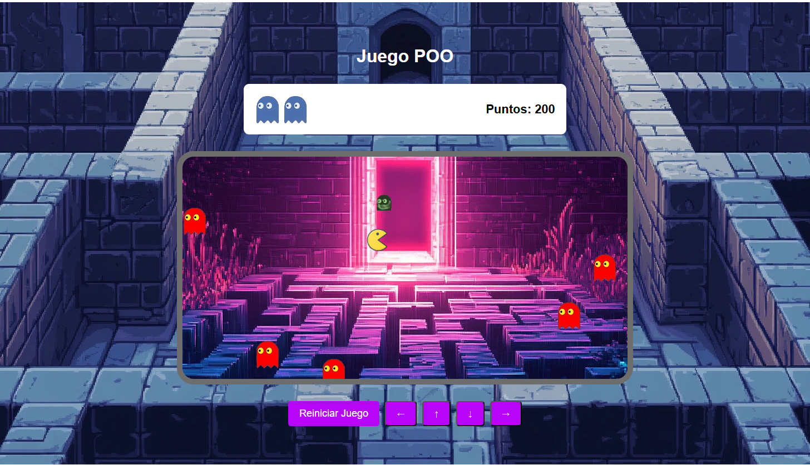

# 👾 Aventuras POO - Juego estilo Pac-Man

¡Bienvenido a Aventuras POO, un emocionante juego basado en navegador que combina la mecánica clásica de Pac-Man con la caza de fantasmas! Este proyecto demuestra los principios de Programación Orientada a Objetos (POO) en JavaScript.

## 🎮 Características del Juego

- **Movimiento Dinámico del Personaje**: Controla tu personaje usando las flechas del teclado o botones en pantalla
- **Múltiples Tipos de Fantasmas**: 
  - Fantasmas regulares que alternan entre estados de movimiento y estático
  - cuando estan en movimiento pueden comer al personaje y finaliza el juego
  - cuando estan parados podemos comer a los fantasmas y nos dan puntos
  - Fantasma verde especial que se teletransporta por el área de juego 
- **Sistema de Puntos**: 
  - 100 puntos por atrapar fantasmas regulares
  - 500 puntos por atrapar el fantasma verde especial
- **Efectos de Sonido**: 
  - Sonidos al capturar fantasmas
  - Sonido especial para la captura del fantasma verde

## 🚀 Comenzando

### Requisitos Previos
- Un navegador web moderno
- Servidor de desarrollo local (recomendado)

### Instalación

1. Clona el repositorio o descarga los archivos
2. Asegúrate de tener la siguiente estructura de archivos:
```
├── index.html
├── style.css
├── main.js
└── img/
    ├── comecocod.png
    ├── comecocoi.png
    ├── comecocoa.png
    ├── comecocobajo.png
    ├── fantasma.png
    ├── fantasma1.png
    ├── fantasma2.png
    ├── fantasma3.png
    ├── fantasma4.png
    ├── fondo2.webp
    ├── fondo3.webp
    ├── sonido.mp3
    └── sonidoterminar.mp3
```

## 🎯 Cómo Jugar

1. Usa las flechas del teclado o los botones en pantalla para mover tu personaje
2. Atrapa los fantasmas cuando estén en su estado parado 
3. ¡Ten cuidado con los fantasmas rojos en movimiento y escapa de ellos si esten en movimiento, si te cazan finaliza el juego
4. con el fantasma verde especial - vale más puntos!
5. Intenta conseguir la mayor puntuación posible
6. Cuando choques con un fantasma rojo en su estado de movimientio, el juego termina o cuando cojas todos los fantasmas

## 🎨 Controles del Juego

- **↑**: Mover Arriba
- **↓**: Mover Abajo
- **←**: Mover Izquierda
- **→**: Mover Derecha
- **Botón Reiniciar**: Comenzar nuevo juego

## 🔧 Detalles Técnicos

### Clases

#### Game
- Controlador principal del juego
- Gestiona el estado del juego, puntuación y colisiones
- Maneja la inicialización y reinicio del juego

#### CosasComun
- Clase base para objetos del juego
- Maneja actualizaciones de posición y detección de colisiones
- Gestiona propiedades comunes como ancho, alto y renderizado de imágenes

#### Comecoco
- Clase del personaje jugador
- Maneja el movimiento y cambios de dirección
- Actualiza el sprite del personaje según la dirección del movimiento

#### Fantasma
- Clase de fantasma regular
- Implementa patrones de movimiento de fantasmas
- Gestiona estados de fantasma (vulnerable/invulnerable)

#### FantasmaEspecial
- Clase del fantasma verde especial
- Implementa comportamiento de teletransporte
- Vale más puntos cuando es atrapado

## 🎨 Estilizado

El juego cuenta con un diseño personalizado que incluye:
- Esquema de colores morado y verde
- Imágenes de fondo personalizadas
- Animaciones suaves
- 
